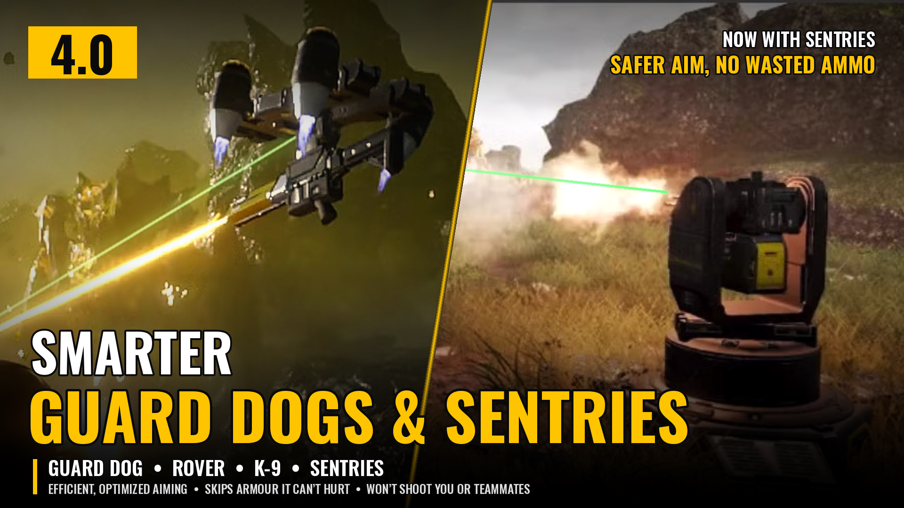

# Smarter Guard Dogs & Sentries
*More efficient, optimized aiming for the Guard Dog, Rover and K-9, your sentries, and now the guns on resupply pods and the Supply FRV.*

Smarter Guard Dogs & Sentries makes the shooting guard dog backpacks and your sentries aim the way you wish they did: they never shoot through you, don't waste ammo, and go for the right target.

## Featured on YouTube
[SwanyPlaysGames - "Helldivers 2 Will NEVER Be the Same!"](https://youtu.be/55fwJxfNaDM?t=456) (the mod is shown from 7:36).

## Guard dog features

- **Never shoots through you or your teammates:** it looks ahead when you spin around, and fires again the moment you're out of its way. The Safety option chooses who it protects: you and your teammates, only you, or only your teammates. The K-9 also avoids arcs that would chain back to you or a teammate.
- **Closest threat first, without the hesitation (Target Prioritization):** the Guard Dog and K-9 get a burst off before they're pulled to the next closer enemy, then catch up.
- **No shooting the dead:** it moves on the moment its target dies.
- **Engages at once:** the moment an enemy it can shoot comes into view, it picks it and opens fire instead of waiting on the game's own re-pick timer.
- **No wasted aiming:** it stops firing the moment its target ducks behind cover, doesn't pick enemies it can't see, and quickly gives up on an enemy it keeps lining up without getting a shot.
- **Skips armor it can't hurt (Armor Intelligence):** the Guard Dog leaves Hulks, Chargers, Tanks, emplacements, bunker turrets and other Heavy armor alone, and only fires short suppressing bursts at Heavy Devastators. The Guard Dog and Rover also leave the guns on Factory Striders and Vox Engines alone. The Rover also leaves Scout Striders alone but still burns Devastators' legs. The K-9 skips nothing.
- **Range:** the Guard Dog ignores enemies beyond its reach (about 32 m), and the Rover sticks to enemies within 35 m while any are around. It's a guard dog: the enemies near you come first.
- **The Rover spreads its fire,** lighting the closest unlit enemies first.

## Sentry features

- **Never fires through you or your teammates:** every sentry holds fire while you're in its line of fire, and the Machine Gun, Gatling, Laser and Flame sentries won't swing their fire across you while turning to the next target. The Autocannon and Rocket sentries won't fire at an enemy close enough to you to catch you in the blast, and the Mortar and EMS Mortar sentries won't shell enemies next to you.
- **No firing into walls:** a sentry drops a target that went behind cover and picks one it can hit.
- **No shooting the dead:** a sentry moves on the moment its target dies.
- **Self-defense first (Target Prioritization):** an enemy right at the sentry that it can hurt is dealt with before anything else, so the sentry isn't wrecked while it chases a better target.
- **Gunships first (Target Prioritization):** the Gatling, Autocannon, Rocket and Laser sentries go for Gunships (and Stingrays on Illuminate missions) before anything else. The Rocket Sentry only fires at one while it hovers, since its rockets miss a moving gunship.
- **The right target for the gun (Target Prioritization):** the Rocket and Autocannon sentries go for Heavy armor first; the Machine Gun, Gatling and Laser sentries go for everything lighter first. An enemy right next to you always stays the target.
- **Skips what it can't hurt (Armor Intelligence):** the Machine Gun and Gatling sentries skip Hulks, Chargers, Tanks and other Heavy armor and fire short bursts at Heavy Devastators; the Laser Sentry skips anything above Heavy. No sentry wastes ammo on dropships, and only the Rocket and Autocannon sentries (whose blast also hurts the dropship) shoot enemies still aboard one.
- **Flame Sentry:** only engages enemies its flames can reach (20 m), not ones well out of range.
- **Laser Sentry:** sets enemies alight and moves on to the next one, like the Rover, and cools down before it burns out (it reads the game's own heat meter and runs between 90% and 70% heat).
- **Tesla Tower:** it no longer zaps you or your teammates when you stand in its range: the mod keeps helldivers off its list of targets. It also leaves enemies within 10 m of a helldiver alone so its arc doesn't chain into you.
- **Armed Resupply Pod and Supply FRV guns:** the guns on Armed Resupply Pods and the M-103 Supply FRV get the same care as the Machine Gun Sentry: safety, armor skipping and the right targets. The FRV gun never stops for riders sitting in the FRV, only for anyone leaning out of a window to shoot.
- **Works with Sentry Aim Retention.**

## Optional targeting laser
A beam shown only on your screen, out of the barrel of your dog and your sentries (not the mortars, which fire over cover) toward their targets: green while firing, flashing red when the safety stops a shot (and a red ring flashes around the Rocket Sentry while an enemy is too close to it to fire), flashing yellow when the dog's target goes out of sight, and off while the dog reloads. The Tesla Tower shows its 20 m reach as a yellow ring instead, lit the whole time it is out. It comes out of each gun's barrel and turns with it (the Rocket and Autocannon sentries: toward where the game aims them, ahead of a moving enemy), and on the Supply FRV gun it shows only while the gun fires.

- **Line** (the default): a thin neon green line with a small cross where it hits. Walls and objects hide it.
- **Glow**: a soft glowing beam with a bright spot on the target. It looks much better than the line, but it shows through walls and objects (the game draws it on top of the world).
- **Laser Brightness**: Normal, Dim (50%), Softer (75%), Bright (150%) or Brightest (200%), for the beams and rings, line or glow.

Only your own dog and sentries are affected (the Safety option also protects the other players from them). Works hosting or joining, finds what it needs again after game patches, and is light on your PC. Hot Dog and Dog Breath are not changed.

## Options (Arsenal / HD2 Mod Manager)

- **Smarter Guard Dogs and Sentries** - the core. Keep this on.
- **Guard Dogs** - turn off to leave your guard dog to the game.
- **Sentries** - your sentries and the guns on resupply pods and the Supply FRV. Choose *All sentries* or *All but the Tesla Tower*, or turn off to leave them to the game.
- **Intelligence** - choose *Armor Intelligence and Target Prioritization*, *Only Armor Intelligence* or *Only Target Prioritization*, or turn off to leave both to the game. Armor Intelligence: skipping armor they can't hurt, short bursts at Heavy Devastators and skipping dropships. Target Prioritization: the closest threat first for the dogs; self-defense, Gunships and the armor that suits the gun first for the sentries.
- **Safety** - choose who they never fire through: *You and your teammates*, *Only you* or *Only your teammates*. Turn off at your own risk.
- **Targeting Laser** - choose *Line* (the default) or *Glow*, or turn off to hide the laser.
- **Laser Brightness** - choose *Normal (100%)* (the default), *Dim (50%)*, *Softer (75%)*, *Bright (150%)* or *Brightest (200%)*.

**In game:** with [Mod Options Menu](https://github.com/CowboyBingus/ModOptionsMenu) installed, every option is also under ESC > MODS > SMARTER GUARD DOGS & SENTRIES, laid out as in the mod manager, and a change takes effect the moment you apply it. The options picked in the mod manager are the starting values.

## Requirements
[Bingus Shared Loader](https://www.nexusmods.com/helldivers2/mods/16292) v15 or newer, last in the load order.

## Download
Get the latest zip from the [Releases](../../releases/latest) page (the `Smarter-Guard-Dogs-and-Sentries-<version>.zip` file, not the source code).

## Install / update

1. Install Bingus Shared Loader v15 or newer.
2. Remove any older version of Smarter Guard Dogs (& Sentries).
3. Add Smarter-Guard-Dogs-and-Sentries-4.5.3.zip in Arsenal or the HD2 Mod Manager and check the options you want.
4. Deploy, then restart the game.

## Uninstall
Remove it in your mod manager and deploy. Nothing is left behind in the game.

## Compatibility

- Works alongside Sentry Aim Retention.
- Supports Mod Options Menu (optional; it needs Bingus Shared Loader v18 or newer).
- Don't combine it with other mods that change guard dog or sentry targeting (for example Laser Rover Targeting Optimization).
- Made and tested on the September 2026 game version. Most testing was done with the Rover against Terminids and Illuminate and the Guard Dog against Automatons and Illuminate, solo and in multiplayer, and with the Machine Gun, Gatling, Autocannon, Rocket and Laser sentries, the Tesla Tower and the Resupply Pod and Supply FRV guns, mostly against Automatons.

## Known limitations

- The game still decides when to shoot. The dog may hold fire on enemies that haven't engaged you yet.
- Brief pauses when you step into the line of fire, by design.
- Line of sight updates about twice a second, so a dog or sentry may briefly fire at cover or hesitate as enemies duck in and out of view.
- Sentries sometimes finish a salvo or burst on their old target before switching.
- The Tesla Tower can't be stopped once it has started a zap, so a helldiver who steps into its path at that moment can still be hit. Going prone still keeps you safe, as in the base game.
- The Glow laser shows through walls and objects (the game draws it on top of the world). Choose Line for a beam that walls hide.
- The Rocket Sentry can't fire while an enemy is within about 10 m of it (the game's rule); a red ring flashes around it then.
- Teammates' sentries run on their own game and aren't changed.
- Safety for teammates may briefly hold fire near a teammate's body right after they reinforce.
- A major game update may switch the mod off until it's updated.

## How it works
**It doesn't alter any game data.** No game files, weapon stats, damage, range or enemy values are changed, unlike mods that rework those. It's a Lua addon that filters your dog's and sentries' choice of target while you play: the game's own targeting stays in charge, and the mod only hides the enemies they shouldn't shoot from their list and asks them to pick again (and keeps helldivers off the Tesla Tower's list of targets). No DLLs are added, no game code is patched, and everything is put back when it's not needed.

## Troubleshooting
Attach SmarterGuardDogsAndSentries.log to your bug report. You'll find it in %LOCALAPPDATA%\CowboyBingus\Helldivers2\Logs, next to the other Bingus mods' logs (paste that into the File Explorer address bar and press Enter). It lists what the mod did, how long each dog and sentry was out and how much of that time it had a target, and any errors.

## Credits

- **retrox** - Laser Rover Targeting Optimization: the original idea and research (independent re-implementation, no shared code).
- **Sentry Aim Retention (CowboyBingus)** - the retarget-on-loss idea.
- **CowboyBingus** - Bingus Shared Loader.
- Armor values: Helldivers Wiki.

## Building from source
The mod is plain Lua: `src/build.py` (Python 3, no extra packages) joins the `engine_*.lua` parts into one script, packs it and the option add-ons into Helldivers 2 patch archives, and writes the Arsenal / HD2 Mod Manager zip to `src/build/`.

```
cd src
python build.py
```

The zip it makes is the same one attached to each release. `python build.py tester` also builds a Tester zip with extra logging for bug hunting.

## Changelog
See [CHANGELOG.md](CHANGELOG.md).

## License
Copyright (c) 2026 Th3chef. All rights reserved. You're welcome to read the source, report bugs and suggest fixes, but please ask before reusing it or reuploading the mod. See [LICENSE](LICENSE).
